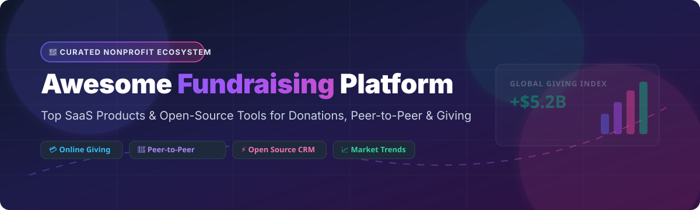

# 🚀 Awesome Fundraising Platform — Top SaaS Products & Open-Source Nonprofit Tools

  
  
  
  
  

> 🎯 **Curated Directory of Top Commercial SaaS Platforms & Self-Hosted Open-Source GitHub Projects for Online Giving, Peer-to-Peer Fundraising, Recurring Donations, Auctions & Nonprofit CRM.**

---

## 📌 Table of Contents

- [📊 Market Overview & Sector Dynamics](#-market-overview--sector-dynamics)
- [💼 Commercial SaaS Fundraising Platforms](#-commercial-saas-fundraising-platforms)
- [⚡ Open-Source GitHub Projects](#-open-source-github-projects)
- [🛠️ Architecture Playbook & Recommendations](#%EF%B8%8F-architecture-playbook--recommendations)
- [🤝 How to Contribute](#-how-to-contribute)
- [💖 Support & Sponsorship](#-support--sponsorship)
- [📈 Star History](#-star-history)
- [⚖️ Disclaimer](#%EF%B8%8F-disclaimer)

---

## 📊 Market Overview & Sector Dynamics

The global **Nonprofit & Online Fundraising Software Market** is currently valued at **~$4.2 Billion** and is projected to expand to over **$8.5 Billion by 2030** (CAGR of ~11.8%). The sector exhibits a **moderately fragmented market structure**, characterized by large established private-equity backed platforms (e.g., GoFundMe Pro/Classy, Bonterra, Bloomerang/Qgiv) leading enterprise fundraising alongside fast-growing disruptive SaaS platforms (e.g., Givebutter, Donorbox, Fundraise Up) and self-hosted open-source software solutions.

---

## 💼 Commercial SaaS Fundraising Platforms

Below is a detailed, structured comparison of leading enterprise and commercial SaaS fundraising tools, **sorted descending by company size (valuation / annual revenue)**:

| SaaS Platform 🚀 | Company Size (Valuation / Revenue) 🏢 | Starting Price 💰 | Free Tier / Free Trial Limits 🎁 | Key Features & Best Used For 💡 |
| :--- | :--- | :--- | :--- | :--- |
| **[GoFundMe / GoFundMe Pro](https://www.classy.org/)** *(formerly Classy)* | **~$4.0B Valuation** / ~$300M+ Annual Rev | **$0/mo** (Consumer) / **$499/mo + 2%** (Enterprise Pro) | 0% platform fee on individual crowdfunding; **No free plan for Pro** (Sales demo only) | Enterprise peer-to-peer campaigns, gala events, recurring giving & donor analytics for major nonprofits. |
| **[JustGiving](https://www.justgiving.com/)** *(Blackbaud)* | **~$3.2B Market Cap** / ~$1.1B Annual Rev | **0% platform fee** (Giving Checkout) + 1.9%–2.9% + $0.30 processing | **Free forever** for individuals & registered charities (optional donor tipping model) | World's leading consumer peer-to-peer giving & charity crowdfunding ecosystem. |
| **[Bonterra / Network for Good](https://www.bonterratech.com/)** | **~$2.5B Valuation** / ~$200M+ Annual Rev | **$200/mo** ($2,400/year billed annually) + payment processing | **No free plan** (Personalized product walkthrough demo required) | Comprehensive nonprofit tech suite covering fundraising, donor management, grants & corporate giving. |
| **[Qgiv / Bloomerang](https://www.qgiv.com/)** | **~$500M Valuation** / ~$50M+ Annual Rev | **$25/mo** (Start plan) + 3.95% + $0.30 per transaction | **30-day free trial** on select packages; no permanent free plan | Online giving forms, text-to-give, auctions & peer-to-peer tightly integrated with Bloomerang CRM. |
| **[Neon One / Neon CRM](https://www.neoncrm.com/)** | **~$180M Valuation** / ~$35M Annual Rev | **$99/mo** (Essential plan) + standard card fees (2.2% + $0.30) | **14-day free trial** sandbox demo; no permanent free tier | Complete donor relationship management (CRM), website builder & event registration for mid-sized charities. |
| **[Fundraise Up](https://fundraiseup.com/)** | **~$150M Valuation** / ~$20M Annual Rev | **$0/mo base fee** + 4% platform fee (0% in donor-cover mode) | **Pay-as-you-go** model with $0 monthly subscription fee | AI-driven conversion optimization, smart recurring donation prompts & multi-currency checkout widgets. |
| **[Donorbox](https://donorbox.org/)** | **~$100M Valuation** / ~$20M Annual Rev | **$0/mo** (Standard) + 1.75% platform fee + Stripe/PayPal fee | **Free forever plan** up to $1,000/mo raised (1.75% platform fee per donation) | Ultra-fast embeddable donation forms, recurring giving, text-to-give & stock/crypto donation acceptance. |
| **[OneCause](https://www.onecause.com/)** | **~$90M Valuation** / ~$30M Annual Rev | **$495/year** (Essentials package) + 2.9% + $0.30 processing | **No free plan** (Interactive 1-on-1 software demo available) | Specialized gala event management, mobile bidding, charity auctions & peer-to-peer event fundraising. |
| **[Givebutter](https://www.givebutter.com/)** | **~$50M Valuation** / ~$15M Annual Rev | **$0/mo** platform fee (0% fee with donor tipping) or 3% flat fee | **Free forever plan** with full features (unlimited forms, events, auctions & P2P) | Modern all-in-one social giving platform with transparent fee structures, embedded forms & built-in CRM. |
| **[Give Lively](https://www.givelively.org/)** | **Non-Profit Funded** ($25M+ Philanthropic Capital) | **$0/mo subscription** + 0% platform fee (only card processing fees) | **Free forever** for verified US 501(c)(3) public charities (unlimited campaigns) | Philanthropically backed zero-cost fundraising platform designed to maximize donor capital efficiency. |

---

## ⚡ Open-Source GitHub Projects

Self-hosted open-source software allows non-profit organizations and developers to retain full data ownership, customize donor checkout flows, and avoid ongoing platform commissions. 

Below are top open-source fundraising, donation, and CRM repositories **sorted descending by GitHub Stars_Count**:

- **[Odoo](https://github.com/odoo/odoo)** — Enterprise Resource Planning (ERP) suite with robust community modules for donation tracking, donor management, and campaign accounting.  
  

- **[ERPNext / Frappe Framework](https://github.com/frappe/erpnext)** — Comprehensive open-source ERP system featuring dedicated nonprofit management modules, membership tracking, and donation receipts.  
  

- **[BTCPay Server](https://github.com/btcpayserver/btcpayserver)** — Self-hosted, open-source cryptocurrency payment processor for accepting Bitcoin and crypto donations directly without third-party fees.  
  

- **[Apache Fineract](https://github.com/apache/fineract)** — Open-source financial services platform and core banking engine suitable for micro-finance, grant disbursement, and community loan pools.  
  

- **[Open Collective Frontend](https://github.com/opencollective/opencollective-frontend)** — Transparent open-source platform designed for open initiatives, software collectives, and fiscal sponsorship groups to raise and disburse funds.  
  

- **[CiviCRM Core](https://github.com/civicrm/civicrm-core)** — The premiere open-source CRM specifically engineered for nonprofits, civic organizations, and advocacy groups with comprehensive contribution tracking.  
  

- **[Open Collective API](https://github.com/opencollective/opencollective-api)** — GraphQL backend API engine supporting Open Collective's fundraising and fiscal host transparent ledger.  
  

- **[Giveth dApp](https://github.com/giveth/giveth-dapp)** — Web3 open-source donation platform enabling zero-fee crypto donations and public-goods funding campaigns.  
  

- **[Donazy](https://github.com/kodingworks/donazy)** — Modern open-source donation management platform built on Laravel for campaign targets and contributor management.  
  

- **[ImpressCMS](https://github.com/impresscms/impresscms)** — Open-source web content management system with community fundraising and donation add-ons.  
  

- **[Happiness](https://github.com/heysanil/happiness)** — Lightweight open-source donation page builder built with Next.js, Stripe Checkout integration, and donor tracking.  
  

- **[Giver](https://github.com/giverio/giver)** — Open-source responsive multi-organization fundraising platform prototype with rewards support and Stripe billing.  
  

---

## 🛠️ Architecture Playbook & Recommendations

For technical teams and growing nonprofits deciding between hosted SaaS and open-source solutions:

1. **Small to Mid-Sized Nonprofits (Low Technical Overhead)**  
   👉 **Recommendation:** Use **Givebutter** or **Donorbox**. Both offer $0/mo entry points, rapid deployment, and high conversion donation widgets without infrastructure maintenance.

2. **Large Enterprises & High-Volume Galas**  
   👉 **Recommendation:** Use **GoFundMe Pro** (Classy) or **OneCause**. These deliver specialized event software, mobile bidding, custom Salesforce CRM integrations, and dedicated enterprise support.

3. **Data-Sovereign & Self-Hosted Organizations**  
   👉 **Recommendation:** Deploy **CiviCRM Core** connected with **Stripe/PayPal APIs** or **ERPNext**. This guarantees complete control over donor personal identifiable information (PII) and zero platform percentage fees.

---

## 🤝 How to Contribute

Contributions are highly appreciated! To submit a new SaaS product or open-source GitHub repository:

1. Fork this repository 🍴
2. Create your feature branch (`git checkout -b feature/add-new-platform`)
3. Update `README.md` maintaining accurate metrics, Stars_Badges, and tabular structure
4. Commit your changes (`git commit -m 'Add new fundraising platform'`)
5. Push to your branch and open a Pull Request 🚀

Please ensure all added entries link directly to official websites or GitHub repositories.

---

## 💖 Support & Sponsorship

If you find this curated directory helpful for your organization or project, please consider supporting us:

- ⭐ **Star this repository** on GitHub to help others discover it!
- 🍴 **Fork the repo** and contribute updates or new tools.
- 📢 **Share** this list with fellow nonprofit builders, developers, and fundraisers!
- ☕ **Buy me a coffee / Sponsor on GitHub:** [https://github.com/sponsors/ishandutta2007](https://github.com/sponsors/ishandutta2007)

Thank you for supporting transparent, accessible, and high-impact fundraising technology! ❤️

---

## 📈 Star History

---

## ⚖️ Disclaimer

*This repository is a community-curated directory for informational purposes only. It is neither an endorsement nor legal, financial, or compliance advice. Always perform due diligence regarding payment security (PCI-DSS), privacy regulations (GDPR/CCPA), and tax-deductible donor compliance when selecting software.*

---

**Made with ❤️ for non-profit organizations, social impact startups, and open-source advocates worldwide.**
